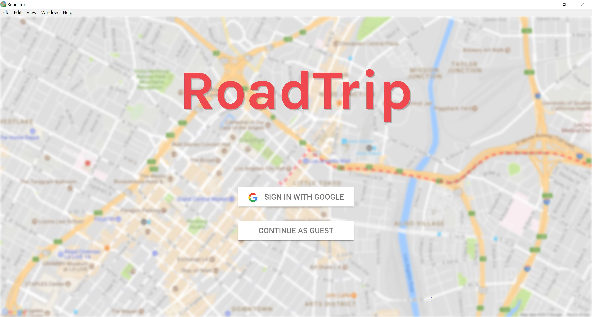
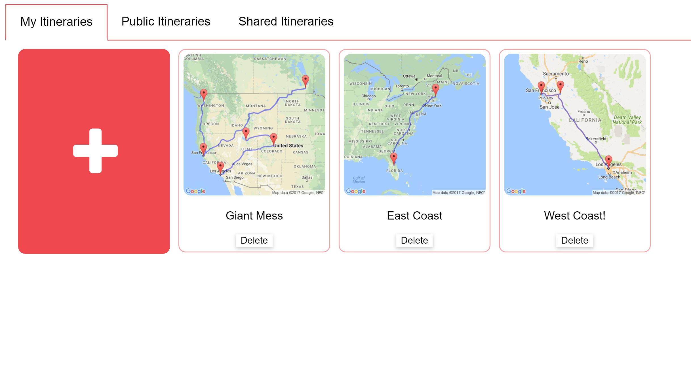
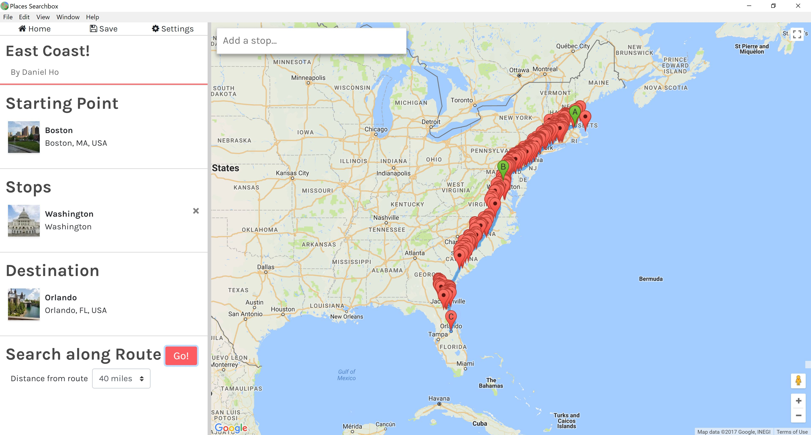

# RoadTripElectron

Electron distribution of RoadTrip App. RoadTrip is a desktop application that helps users plan out routes and stops. Its main features include but no exclude to:
1. Authenticated User Login & Guest Login
2. Create & Save New Itineraries
3. Share Itineraries
4. View Public Itineraries
5. Edit Itineraries concurrently with all shared users
6. Suggest interesting tour sites along the route

## Installation/Deployment

### Server
- Install MongoDB
- Install Java
- Install Node.js
- Install Electron.js through Node package manager
- Start the database server
- Start the Java back-end server

### Client
- Import project files
- Launch the executable file

## Links

- Backend code: https://github.com/201GroupMap/RoadTrip--Backend
- Frontend code: https://github.com/201GroupMap/FrontEnd
- Presentation link: https://docs.google.com/presentation/d/1gk5Ufc7oNi9eev83MdpBkvMP38ABMuduI_-z0clmkKQ/edit?usp=sharing
- Full Documentation link: https://docs.google.com/document/d/1oefRuWHTz7_vEwGHLRMk7bNn2xy7MTagyspDpIY-Mss/edit?usp=sharing
- Demo video link: https://drive.google.com/file/d/1GO41ahgkIPBRQwSBp6rFMF17aI37Xic4/view?usp=sharing

## Preview

### Login

### My Itineraries

### Suggestions along the route

